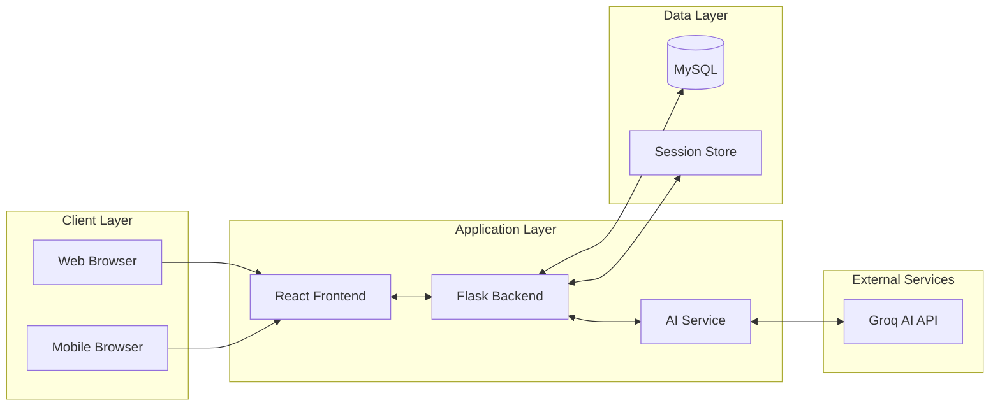

# 🧠 Quiz AI - Intelligent Quiz Generation Platform

<div align="center">

[](https://python.org)
[](https://reactjs.org)
[](https://flask.palletsprojects.com)
[](https://mysql.com)
[](https://docker.com)
[](https://kubernetes.io)
[](https://github.com/features/actions)
[](LICENSE)

**Transform your documents into intelligent, interactive quizzes using state-of-the-art AI technology**

[Features](#-key-features) • [Quick Start](#-quick-start) • [Architecture](docs/ARCHITECTURE.md) • [API Docs](#-api-reference) • [Contributing](#-contributing)

📖 **Documentation Hub**: [docs/](docs/) | 🏗️ **Architecture Overview**: [Quick Guide](docs/QUICK_START_ARCHITECTURE.md) | 🔄 **Infrastructure Details**: [Separation Guide](docs/diagrams/infrastructure-separation.md)

</div>

---

## 📋 Table of Contents

- [Overview](#-overview)
- [Key Features](#-key-features)
- [System Architecture](#-system-architecture)
- [Quick Start](#-quick-start)
- [Development](#-development)
- [Deployment](#-deployment)
- [API Reference](#-api-reference)
- [Testing](#-testing)
- [Contributing](#-contributing)
- [License](#-license)

## 🎯 Overview

Quiz AI is a cloud-native, enterprise-ready platform that leverages advanced AI models to automatically generate comprehensive quizzes from uploaded documents. Built with a microservices architecture, it offers seamless scalability, high availability, and modern DevOps practices including containerization, orchestration, and GitOps workflows.

## ✨ Key Features

### 🤖 **AI-Powered Intelligence**
- **Advanced AI Model**: Powered by Groq's LLaMA 3.3 70B for superior question quality
- **Smart Content Analysis**: Intelligent document parsing and context understanding
- **Multilingual Support**: Automatic language detection and localized quiz generation
- **Adaptive Difficulty**: Questions tailored to content complexity

### 📚 **Document Processing**
- **Multiple Formats**: PDF, DOCX, TXT with robust error handling
- **Batch Processing**: Handle multiple documents simultaneously
- **Text Extraction**: Advanced parsing with PyPDF2 and python-docx
- **Content Validation**: Automatic quality checks and preprocessing

### 🎮 **Quiz Modes & Types**
- **Practice Mode**: Immediate feedback with detailed explanations
- **Exam Mode**: Timed assessments with auto-submission
- **Question Variety**: Single choice, multiple choice with explanations
- **Custom Settings**: Adjustable question count and time limits

### 👥 **User Experience**
- **Authentication System**: Secure JWT-based authentication
- **Guest Access**: Try without registration (limited features)
- **Quiz Management**: Personal library with history tracking
- **Progress Analytics**: Detailed performance metrics and insights
- **Responsive Design**: Optimized for all devices and screen sizes

### 🏗️ **Enterprise Architecture**
- **Microservices Design**: Scalable, maintainable architecture
- **Container-Ready**: Docker images for all components
- **Cloud-Native**: Kubernetes-ready with Helm charts
- **High Availability**: Multi-AZ deployment with auto-scaling
- **GitOps Workflow**: Automated deployments via ArgoCD

## 🏗️ System Architecture

> **📖 Full Architecture Documentation**: See [ARCHITECTURE.md](docs/ARCHITECTURE.md) for detailed system design, infrastructure diagrams, and deployment flows.

### High-Level Overview



### Project Structure

```
Quiz_AI/
├── 📱 Frontend/              # React TypeScript Application
│   ├── src/                 # Source code
│   ├── public/              # Static assets
│   └── Dockerfile           # Multi-stage build
│
├── 🔧 Backend/               # Flask Python API
│   ├── ai_models/           # AI processing modules
│   ├── app.py               # Main application
│   └── Dockerfile           # Python container
│
├── 🏗️ Infra/                 # Infrastructure as Code
│   ├── live/                # Environment configs
│   ├── modules/             # Terraform modules
│   ├── quiz-ai-helm/        # Helm charts
│   └── argocd/              # GitOps configs
│
├── 🧪 tests/                 # Test suites
│   ├── all_tests.py         # Integration tests
│   └── test_database.py     # Database tests
│
├── 🚀 .github/workflows/     # CI/CD pipelines
│   ├── dev-dockerhub-ci.yml # Dev pipeline
│   ├── main-ecr-cd.yml      # Prod pipeline
│   └── testing.yaml         # Test automation
│
└── 📦 docker-compose.yaml    # Local development
```

## 🚀 Quick Start

### 🐳 Docker Compose (Recommended)

```bash
# Clone repository
git clone https://github.com/yourusername/Quiz_AI.git
cd Quiz_AI

# Create environment file
cp Backend/.env.example Backend/.env
# Edit Backend/.env with your credentials

# Start services
docker-compose up -d

# Access application
# Frontend: http://localhost:3000
# Backend API: http://localhost:8000
```

### ⚙️ Manual Setup

#### Prerequisites
- Python 3.12+
- Node.js 18+ & npm
- MySQL 8.0+
- Groq API Key ([Get one here](https://console.groq.com))

#### 1. Backend Setup
```bash
cd Backend

# Create virtual environment
python -m venv venv
source venv/bin/activate  # Windows: venv\Scripts\activate

# Install dependencies
pip install -r requirements.txt

# Configure environment
cp .env.example .env
# Edit .env with your settings
```

#### 2. Database Setup
```bash
# Create MySQL database
mysql -u root -p
CREATE DATABASE quiz_ai;
EXIT;

# Run database setup
python database_setup.py
```

#### 3. Frontend Setup
```bash
cd Frontend

# Install dependencies
npm install

# Development mode
npm run dev

# Production build
npm run build
```

#### 4. Start Services
```bash
# Terminal 1: Backend
cd Backend && python app.py

# Terminal 2: Frontend (dev)
cd Frontend && npm run dev

# Access at http://localhost:3000
```

## 🔌 API Reference

### Authentication Endpoints

#### Register User
```http
POST /api/register
Content-Type: application/json

{
  "mail": "user@example.com",
  "password": "secure_password"
}
```

#### Login User
```http
POST /api/login
Content-Type: application/json

{
  "mail": "user@example.com",
  "password": "secure_password"
}
```

### Quiz Generation

#### Generate Quiz
```http
POST /api/generate-questions
Content-Type: multipart/form-data

file: [PDF/DOCX/TXT file]
numQuestions: 5
mode: "practice" | "exam"
duration: 30 (minutes, for exam mode)
userId: 123
quizTitle: "My Quiz"
```

#### Check Job Status
```http
GET /api/job-status/{job_id}
```

### Quiz Management

#### Get User Quizzes
```http
GET /api/quizzes/user/{user_id}
```

#### Get Specific Quiz
```http
GET /api/quizzes/{quiz_id}
```

## 🧪 Testing

### Run Complete Test Suite
```bash
cd tests

# Install test dependencies
pip install -r tests_requirements.txt

# Start your Flask server first
cd ../Backend && python3 app.py

# Run all tests (in another terminal)
cd ../tests && python3 run_tests.py
```

### Test Coverage
- **Health Tests** (3): API connectivity and performance
- **Authentication Tests** (6): User registration and login flows
- **Quiz Generation Tests** (4): File upload and quiz creation

## 💻 Development

### Technology Stack

#### Frontend
- **Framework**: React 18 with TypeScript
- **Build Tool**: Vite for fast development
- **Styling**: TailwindCSS + ShadCN/UI components
- **State Management**: Zustand for global state
- **HTTP Client**: Axios with interceptors

#### Backend
- **Framework**: Flask 3.0 with Python 3.12
- **AI Integration**: Groq API (LLaMA 3.3 70B)
- **Document Processing**: PyPDF2, python-docx
- **Database**: MySQL 8.0 with JSON support
- **Authentication**: JWT tokens

#### Infrastructure
- **Containerization**: Docker with multi-stage builds
- **Orchestration**: Kubernetes (EKS)
- **IaC**: Terraform + Terragrunt
- **GitOps**: ArgoCD for continuous deployment
- **CI/CD**: GitHub Actions

### Environment Configuration

```env
# Backend/.env
MYSQL_HOST=localhost
MYSQL_PORT=3306
MYSQL_USER=root
MYSQL_PASSWORD=your_password
MYSQL_DATABASE=quiz_ai
GROQ_API_KEY=your_groq_api_key

# Optional: For production
MYSQL_SSL_CA=/path/to/ca.pem
JWT_SECRET_KEY=your_jwt_secret
FLASK_ENV=production
```

### Development Commands

```bash
# Backend development
cd Backend
python app.py --debug

# Frontend development with hot reload
cd Frontend
npm run dev

# Run tests
cd tests
python run_tests.py

# Build Docker images
docker-compose build

# Format code
npm run format  # Frontend
python -m black .  # Backend
```

## ⚙️ Configuration

### Database Schema

```sql
-- Users table
CREATE TABLE users (
    id INT PRIMARY KEY AUTO_INCREMENT,
    mail VARCHAR(255) UNIQUE NOT NULL,
    password_hash VARCHAR(255) NOT NULL,
    created_at TIMESTAMP DEFAULT CURRENT_TIMESTAMP
);

-- Quizzes table
CREATE TABLE quizzes (
    id INT PRIMARY KEY AUTO_INCREMENT,
    user_id INT,
    title VARCHAR(255),
    quiz_data JSON,
    created_at TIMESTAMP DEFAULT CURRENT_TIMESTAMP,
    FOREIGN KEY (user_id) REFERENCES users(id)
);
```

### Application Settings

| Setting | Value | Description |
|---------|-------|-------------|
| Max File Size | 10MB | Maximum upload size |
| Supported Formats | PDF, DOCX, TXT | Allowed file types |
| Session Timeout | 30 minutes | User session duration |
| API Rate Limit | 100 req/min | Per-user rate limiting |
| Question Limit | 20 per quiz | Maximum questions |

### AI Model Configuration

| Parameter | Value | Description |
|-----------|-------|-------------|
| Model | LLaMA 3.3 70B | Groq AI model |
| Temperature | 0.7 | Response creativity |
| Max Tokens | 4096 | Maximum response length |
| Top P | 0.9 | Token selection threshold |
| Stream | False | Response streaming |

## 🚀 Deployment

### 🏭 Production Deployment

The application is designed for cloud-native deployment with full CI/CD automation:

#### Kubernetes Deployment
```bash
# Deploy using Helm
helm install quiz-ai ./Infra/quiz-ai-helm \
  -f ./Infra/quiz-ai-helm/production_values.yaml \
  -n app-prod --create-namespace

# Verify deployment
kubectl get pods -n app-prod
kubectl get ingress -n app-prod
```

#### GitOps with ArgoCD
```yaml
# Automatic deployment via ArgoCD
# Push to main branch triggers:
1. Build & push to AWS ECR
2. Update Helm values
3. ArgoCD syncs changes
4. Rolling deployment to K8s
```

### 📋 Production Checklist

- [ ] **Security**
  - [ ] Configure TLS certificates
  - [ ] Set secure JWT secrets
  - [ ] Enable WAF rules
  - [ ] Configure security groups
  
- [ ] **Database**
  - [ ] Setup MySQL replication
  - [ ] Configure automated backups
  - [ ] Test disaster recovery
  - [ ] Enable SSL connections
  
- [ ] **Monitoring**
  - [ ] Setup application metrics
  - [ ] Configure alerting rules
  - [ ] Enable log aggregation
  - [ ] Setup uptime monitoring
  
- [ ] **Performance**
  - [ ] Configure CDN for static assets
  - [ ] Enable response caching
  - [ ] Setup horizontal autoscaling
  - [ ] Optimize database queries

### 🌍 Environment URLs

| Environment | URL | Description |
|-------------|-----|-------------|
| Development | `http://dev.quiz-ai.local` | Development cluster |
| Staging | `https://staging.quiz-ai.com` | Staging environment |
| Production | `https://quiz-ai.com` | Production site |

## 🤝 Contributing

1. Fork the repository
2. Create feature branch (`git checkout -b feature/amazing-feature`)
3. Commit changes (`git commit -m 'Add amazing feature'`)
4. Push to branch (`git push origin feature/amazing-feature`)
5. Open Pull Request

## 🔒 Security

### Security Features
- JWT-based authentication
- Password hashing with bcrypt
- SQL injection prevention
- XSS protection
- CSRF tokens
- Rate limiting
- Input validation
- Secure file uploads

### Reporting Security Issues
Please report security vulnerabilities to [security@quiz-ai.com](mailto:security@quiz-ai.com)

## 📊 Performance

### Benchmarks
| Metric | Value | Conditions |
|--------|-------|------------|
| API Response Time | < 200ms | Average latency |
| Quiz Generation | < 5s | 10 questions |
| Concurrent Users | 1000+ | Per instance |
| Uptime SLA | 99.9% | Monthly target |

## 🧩 Integrations

- **AI Provider**: Groq Cloud API
- **Database**: Aiven MySQL (Production)
- **Container Registry**: Docker Hub / AWS ECR
- **Cloud Provider**: AWS (EKS, VPC, IAM)
- **Monitoring**: Kubernetes Metrics Server
- **CI/CD**: GitHub Actions
- **GitOps**: ArgoCD

## 📝 License

This project is licensed under the MIT License - see the [LICENSE](LICENSE) file for details.

## 🙏 Acknowledgments

- [Groq](https://groq.com) - AI infrastructure provider
- [React](https://reactjs.org) - UI framework
- [Flask](https://flask.palletsprojects.com) - Python web framework
- [ShadCN/UI](https://ui.shadcn.com) - Component library
- [Tailwind CSS](https://tailwindcss.com) - CSS framework
- [Kubernetes](https://kubernetes.io) - Container orchestration
- [Terraform](https://terraform.io) - Infrastructure as Code

## 📞 Support

- **Documentation**: [docs/](docs/)
- **Issues**: [GitHub Issues](https://github.com/yourusername/Quiz_AI/issues)
- **Discussions**: [GitHub Discussions](https://github.com/yourusername/Quiz_AI/discussions)
- **Email**: support@quiz-ai.com

## 🌟 Star History

[](https://star-history.com/#yourusername/Quiz_AI&Date)

---

<div align="center">

**Built with ❤️ by Ilay**

[](https://github.com/ilay)

</div>
