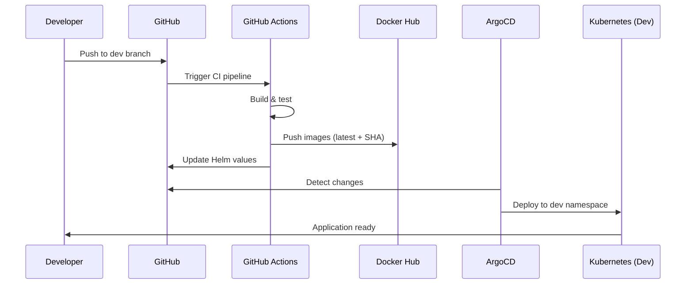
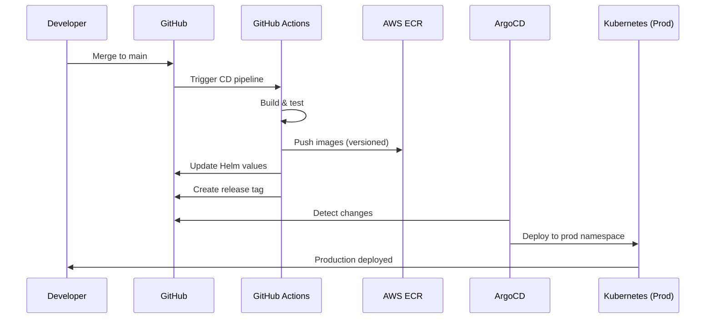

# 🏗️ Quiz AI - System Architecture

## Overview

Quiz AI is a cloud-native, microservices-based application designed with clear separation between application code and infrastructure. The system leverages modern DevOps practices including containerization, orchestration, GitOps, and Infrastructure as Code (IaC).

## Architecture Diagram

```mermaid
graph TB
    subgraph "External Services"
        GH[GitHub]
        DH[Docker Hub]
        ECR[AWS ECR]
        GROQ[Groq AI API]
        AIVEN[Aiven MySQL]
    end

    subgraph "User Layer"
        USER[Users/Browsers]
    end

    subgraph "Application Layer"
        subgraph "Frontend Application"
            REACT[React 18 + TypeScript<br/>Vite + TailwindCSS<br/>ShadCN/UI Components]
            ZUSTAND[Zustand Store]
        end

        subgraph "Backend Application"
            FLASK[Flask API Server]
            AUTH[Authentication Service]
            QUIZ[Quiz Generator Service]
            PROCESSOR[Document Processor]
            AI[AI Integration Layer]
        end
    end

    subgraph "Infrastructure Layer"
        subgraph "AWS Cloud"
            subgraph "Kubernetes Cluster (EKS)"
                subgraph "Ingress Layer"
                    NGINX[NGINX Ingress Controller]
                    NLB[Network Load Balancer]
                end
                
                subgraph "Application Namespaces"
                    DEV_NS[app-dev namespace]
                    PROD_NS[app-prod namespace]
                    
                    subgraph "Kubernetes Resources"
                        DEPLOY[Deployments]
                        SVC[Services]
                        CM[ConfigMaps]
                        SECRET[Secrets]
                        HPA[HPA]
                    end
                end
                
                subgraph "Platform Services"
                    ARGO[ArgoCD]
                    METRICS[Metrics Server]
                    CERT[Cert Manager]
                end
            end
            
            subgraph "AWS Services"
                VPC[VPC]
                IAM[IAM Roles]
                SM[Secrets Manager]
            end
        end
    end

    subgraph "Infrastructure as Code"
        subgraph "Terraform/Terragrunt"
            TF_VPC[VPC Module]
            TF_EKS[EKS Module]
            TF_IAM[IAM Module]
            TF_K8S[K8s Resources Module]
            TF_SEC[Secrets Module]
        end
        
        subgraph "Helm Charts"
            HELM[quiz-ai-helm Chart]
            VALUES[Environment Values]
        end
        
        subgraph "GitOps"
            MANIFESTS[K8s Manifests]
            ARGO_APP[ArgoCD Applications]
        end
    end

    subgraph "CI/CD Pipeline"
        subgraph "GitHub Actions"
            CI_DEV[Dev CI Pipeline]
            CI_PROD[Prod CD Pipeline]
            TEST[Testing Pipeline]
        end
    end

    %% User Flow
    USER -->|HTTPS| NLB
    NLB --> NGINX
    NGINX -->|Route /api| FLASK
    NGINX -->|Route /| REACT

    %% Application Connections
    REACT <-->|API Calls| FLASK
    FLASK --> AUTH
    FLASK --> QUIZ
    QUIZ --> PROCESSOR
    QUIZ --> AI
    AI -->|API| GROQ
    FLASK -->|SSL/TLS| AIVEN
    ZUSTAND <--> REACT

    %% CI/CD Flow
    GH -->|Trigger| CI_DEV
    GH -->|Trigger| CI_PROD
    CI_DEV -->|Build & Push| DH
    CI_PROD -->|Build & Push| ECR
    CI_DEV -->|Update| VALUES
    CI_PROD -->|Update| VALUES
    
    %% GitOps Flow
    ARGO -->|Sync| MANIFESTS
    ARGO -->|Deploy| HELM
    HELM -->|Create| DEPLOY
    DEPLOY --> DEV_NS
    DEPLOY --> PROD_NS

    %% Infrastructure Management
    TF_VPC -->|Provision| VPC
    TF_EKS -->|Provision| EKS
    TF_IAM -->|Create| IAM
    TF_K8S -->|Configure| ARGO
    TF_SEC -->|Manage| SM
    SM -->|Inject| SECRET

    style USER fill:#e1f5fe
    style REACT fill:#61dafb
    style FLASK fill:#000000,color:#ffffff
    style ARGO fill:#ff6b35
    style DH fill:#2496ed
    style ECR fill:#ff9900
    style GROQ fill:#00d4ff
    style AIVEN fill:#ff3554
```



## Component Separation

### 🎯 Application Code (Base Code)
Located in the main repository structure, focusing on business logic and features:

```
Quiz_AI/
├── Frontend/                 # React Application
│   ├── src/
│   │   ├── components/      # UI Components
│   │   ├── hooks/          # Custom React Hooks
│   │   ├── lib/            # Utilities & API Client
│   │   └── App.tsx         # Main Application
│   └── Dockerfile          # Frontend Container
│
├── Backend/                 # Flask Application
│   ├── ai_models/          # AI Processing
│   │   ├── text_processor.py
│   │   └── question_generator.py
│   ├── app.py              # Main Flask Server
│   └── Dockerfile          # Backend Container
│
└── tests/                   # Test Suites
    ├── all_tests.py
    └── test_database.py
```

### 🏗️ Infrastructure Code
Completely separated infrastructure management using IaC principles:

```
Infra/
├── live/                    # Environment-specific Configurations
│   ├── dev/                # Development Environment
│   │   ├── vpc/           # Network Infrastructure
│   │   ├── eks/           # Kubernetes Cluster
│   │   ├── iam/           # Identity & Access
│   │   ├── k8s/           # K8s Resources
│   │   ├── k8s-platform/  # Platform Services
│   │   ├── secrets/       # Secret Management
│   │   └── argocd/        # GitOps Configuration
│   └── prod/              # Production Environment
│
├── modules/                # Reusable Terraform Modules
│   ├── vpc/
│   ├── eks/
│   ├── iam/
│   └── k8s-resources/
│
├── quiz-ai-helm/          # Helm Chart
│   ├── templates/         # K8s Templates
│   ├── development_values.yaml
│   ├── staging_values.yaml
│   └── production_values.yaml
│
├── manifests/             # K8s Manifests
│   ├── dev/
│   └── prod/
│
└── argocd/                # ArgoCD Applications
    ├── dev/
    └── prod/
```

## Technology Stack

### Application Technologies
- **Frontend**: React 18, TypeScript, Vite, TailwindCSS, ShadCN/UI, Zustand
- **Backend**: Flask, Python 3.12, PyPDF2, python-docx
- **AI/ML**: Groq API (LLaMA 3.3 70B)
- **Database**: MySQL 8.0 (Aiven managed)

### Infrastructure Technologies
- **Container**: Docker, Multi-stage builds
- **Orchestration**: Kubernetes (EKS)
- **IaC**: Terraform, Terragrunt
- **GitOps**: ArgoCD
- **CI/CD**: GitHub Actions
- **Registry**: Docker Hub (Dev), AWS ECR (Prod)
- **Ingress**: NGINX Ingress Controller
- **Monitoring**: Kubernetes Metrics Server

## Deployment Flows

### Development Pipeline


### Production Pipeline


## Security Layers

1. **Network Security**
   - VPC with private subnets
   - Security groups and NACLs
   - TLS/SSL termination at ingress

2. **Application Security**
   - JWT authentication
   - API rate limiting
   - Input validation and sanitization

3. **Infrastructure Security**
   - IAM roles and policies
   - Kubernetes RBAC
   - Secrets management (AWS Secrets Manager)
   - Encrypted communication (TLS/SSL)

4. **CI/CD Security**
   - GitHub secrets for credentials
   - Least privilege IAM roles
   - Image scanning in pipelines

## Scalability Features

- **Horizontal Pod Autoscaling**: Based on CPU/memory metrics
- **Rolling Updates**: Zero-downtime deployments
- **Load Balancing**: AWS NLB + NGINX Ingress
- **Stateless Architecture**: Easy horizontal scaling
- **Caching**: Browser caching for static assets

## Monitoring & Observability

- **Health Checks**: Liveness and readiness probes
- **Metrics**: Kubernetes metrics server
- **Logging**: Centralized container logs
- **Alerts**: Based on health endpoints

## High Availability

- **Multi-AZ Deployment**: EKS nodes across availability zones
- **Database HA**: Aiven managed MySQL with automatic failover
- **Container Orchestration**: Kubernetes self-healing
- **GitOps**: Declarative infrastructure with automatic reconciliation
