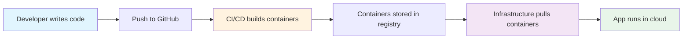

# 🚀 Quiz AI - Quick Architecture Guide

## At a Glance

Quiz AI follows a **clear separation** between **application code** and **infrastructure code**:

```
┌─────────────────────────────────────────────────────────────┐
│                        Quiz AI Platform                      │
├─────────────────────────────────────────────────────────────┤
│                                                               │
│  📱 APPLICATION LAYER           🏗️ INFRASTRUCTURE LAYER      │
│  ┌──────────────────┐          ┌──────────────────┐        │
│  │   Frontend/      │          │   Infra/         │        │
│  │   - React App    │          │   - Terraform    │        │
│  │   - TypeScript   │          │   - Kubernetes   │        │
│  │   - UI/UX        │          │   - Helm Charts  │        │
│  └──────────────────┘          └──────────────────┘        │
│  ┌──────────────────┐          ┌──────────────────┐        │
│  │   Backend/       │          │   .github/       │        │
│  │   - Flask API    │          │   - CI/CD        │        │
│  │   - Python       │          │   - Automation   │        │
│  │   - Business     │          │   - Workflows    │        │
│  └──────────────────┘          └──────────────────┘        │
│                                                               │
└─────────────────────────────────────────────────────────────┘
```

## 🎯 Key Principles

### 1. **Application Code** = What Your App Does
- Business logic and features
- User interfaces and experiences
- API endpoints and data processing
- AI integration and quiz generation

### 2. **Infrastructure Code** = Where Your App Runs
- Cloud resources (AWS, Kubernetes)
- Networking and security
- Deployment configurations
- Monitoring and scaling

## 📁 Directory Map

```bash
Quiz_AI/
│
├── 📱 APPLICATION CODE (/Frontend, /Backend)
│   └── Your business logic lives here
│
├── 🏗️ INFRASTRUCTURE CODE (/Infra)
│   └── Your cloud setup lives here
│
├── 🧪 TESTING (/tests)
│   └── Your quality assurance lives here
│
└── 🚀 AUTOMATION (/.github/workflows)
    └── Your CI/CD pipelines live here
```

## 🔄 How They Work Together



## 🚦 Quick Decision Guide

| If you want to... | Look in... | File types |
|------------------|------------|------------|
| Add a new feature | `/Frontend` or `/Backend` | `.tsx`, `.py` |
| Change UI components | `/Frontend/src` | `.tsx`, `.css` |
| Modify API endpoints | `/Backend/app.py` | `.py` |
| Scale the application | `/Infra/quiz-ai-helm` | `.yaml` |
| Add cloud resources | `/Infra/modules` | `.tf` |
| Update deployment | `/Infra/live` | `.hcl`, `.tf` |
| Modify CI/CD | `/.github/workflows` | `.yml` |

## 🎓 Learning Path

### For Frontend Developers
1. Start with `/Frontend/src/App.tsx`
2. Explore `/Frontend/src/components`
3. Check `/Frontend/src/lib` for API calls

### For Backend Developers
1. Start with `/Backend/app.py`
2. Explore `/Backend/ai_models`
3. Check database setup in `/Backend`

### For DevOps Engineers
1. Start with `/Infra/quiz-ai-helm`
2. Explore `/Infra/modules`
3. Check `/Infra/live` for environments

### For Full-Stack Engineers
1. Run `docker-compose up` locally
2. Explore both Frontend and Backend
3. Understand the API contract

## 🛠️ Common Tasks

### Deploy a Feature
```bash
1. Code in /Frontend or /Backend
2. Push to dev branch
3. CI/CD automatically builds and deploys
4. ArgoCD syncs to Kubernetes
```

### Add Infrastructure
```bash
1. Define in /Infra/modules
2. Configure in /Infra/live
3. Run Terraform plan/apply
4. Resources are provisioned
```

### Update Configuration
```bash
1. Modify Helm values in /Infra/quiz-ai-helm
2. Push changes
3. ArgoCD detects and applies
4. Rolling update occurs
```

## 💡 Best Practices

### ✅ DO
- Keep business logic in application code
- Keep infrastructure definitions in Infra/
- Use environment variables for configuration
- Version control everything
- Document your changes

### ❌ DON'T
- Mix infrastructure with application code
- Hardcode environment-specific values
- Manually modify cloud resources
- Skip testing before deployment
- Ignore security best practices

## 🔗 Next Steps

- **Detailed Architecture**: [ARCHITECTURE.md](ARCHITECTURE.md)
- **Infrastructure Deep Dive**: [diagrams/infrastructure-separation.md](diagrams/infrastructure-separation.md)
- **Main README**: [../README.md](../README.md)

---

💡 **Remember**: Application code is WHAT you build, Infrastructure code is WHERE it runs!
